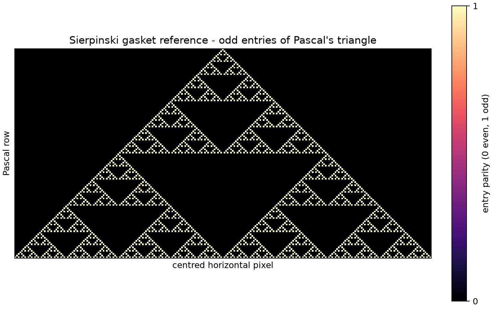
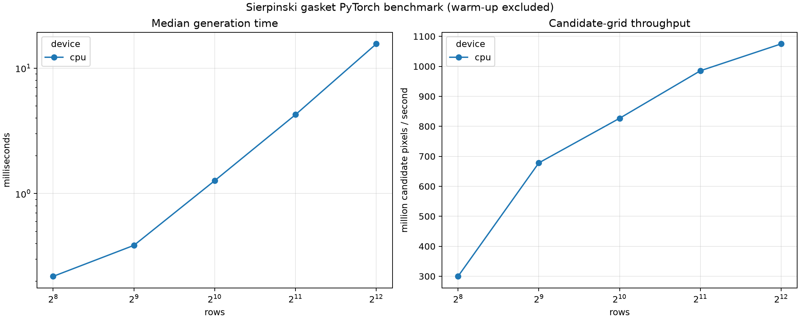

# COMP3710 Lab 1 Part 3 - Sierpinski Gasket

This repository develops the **Sierpinski gasket by binary addresses** from
Section 2.10 of *Fractals for the Classroom*. It is a new Part 3 project and
does not reuse the earlier Sierpinski carpet proposal.

## Current status

- Fractal choice: confirmed from a textbook section explicitly suggested by
  the lab sheet.
- Development stage: reference implementation, PyTorch core, dimension
  analysis, and repeatable local CPU benchmark complete.
- Remote repository: connected to the student-created GitHub repository.
- The submitted figures and CSV files under `outputs/` were generated locally
  by the same commands documented below.

## Planned evidence

1. A small NumPy/Python reference based on the parity of Pascal's triangle.
2. Independent checks using exact binomial coefficients and known point
   counts.
3. A reviewed PyTorch implementation in which pixels are evaluated in
   parallel on CPU, with optional Apple MPS or NVIDIA CUDA support when those
   devices are available.
4. Repeatable CPU timing at several image sizes.
5. A box-counting estimate compared with the theoretical dimension
   `log(3) / log(2)`.
6. More than one visualisation, with parameters and colours explained.
7. Course-required AI-use documentation maintained separately by the student.

## Local environment

The existing `comp3710` conda environment can be reused:

```bash
conda activate comp3710
cd /Users/baoxuwang/Documents/3710/part3_sierpinski_gasket
```

To recreate it later:

```bash
conda env create -f environment.yml
```

Run the completed reference stage with:

```bash
python tests/verify_reference.py
python src/reference_gasket.py --rows 128
```

The first command compares the binary-address result with exact binomial
coefficients. The second writes `outputs/reference_gasket.png`.

Run the reviewed PyTorch stage with:

```bash
python tests/verify_torch_gasket.py
python src/torch_gasket.py --rows 256 --device cpu
```

`--device` accepts `auto`, `cpu`, `mps`, or `cuda`; the submitted demonstration
uses `cpu` so it runs without a GPU. The program keeps the calculation on the
selected device and transfers only the finished raster to CPU for Matplotlib.

Run the dimension and colour analysis with:

```bash
python tests/verify_analysis.py
python src/analyse_gasket.py --rows 1024 --device cpu
```

This writes a three-panel figure and the measured box counts to `outputs/`.

Run the repeatable local benchmark with:

```bash
python tests/verify_benchmark.py
python src/benchmark_gasket.py \
  --sizes 256 512 1024 2048 4096 \
  --devices cpu \
  --warmups 3 \
  --repeats 9
```

The benchmark saves every run to CSV and plots median time and candidate-grid
throughput. Warm-up runs are excluded from the reported statistics.

## AI documentation ownership

The student will maintain and organise the course-required AI-use record. The
project automation will not create or update that record unless the student
explicitly requests it later.

## Reference-stage result

For 128 (`2^7`) rows, the reference contains 2,187 (`3^7`) odd Pascal
entries. Its centred raster has shape `128 x 255`. The generated figure has
been visually reviewed and shows the expected recursive triangular gaps.

## PyTorch-stage result

The CPU tensor agrees element-for-element with the NumPy reference. For 256
(`2^8`) rows, it contains 6,561 (`3^8`) points in a `256 x 511` centred
raster. The generated figure was visually inspected.
The printed time from a single command includes first-use overhead and is not
treated as a benchmark; repeated warm-up experiments are a later stage.

## Dimension-analysis result

For a 1,024-row gasket, power-of-two box sizes from 1 through 256 produced
counts from 59,049 down to 9. The fitted box-counting dimension was
`1.584962501`, agreeing with `log(3) / log(2)` to floating-point precision,
with `R^2 = 1.0`. The analysis figure includes the binary view, an
address-balance colour view, and the fitted log-log line.

## Local benchmark result

The submitted benchmark uses CPU at five image sizes, three discarded warm-up
runs, and nine measured runs per size. This is sufficient for the lab because
the main requirement is that PyTorch tensor operations perform the pixel tests
in parallel rather than a Python loop. Complete methods and measured values are
recorded in `BENCHMARK_RESULTS.md` and `outputs/benchmark_results.csv`.

## Demonstration outputs

All figures below are committed so they remain visible during the demo. They
can also be regenerated locally using the commands above.

### Independent reference



### PyTorch CPU result


### Dimension and address-colour analysis


### Repeatable CPU benchmark



The raw benchmark measurements and box counts are available in
[`outputs/benchmark_results.csv`](outputs/benchmark_results.csv) and
[`outputs/box_counts.csv`](outputs/box_counts.csv).
