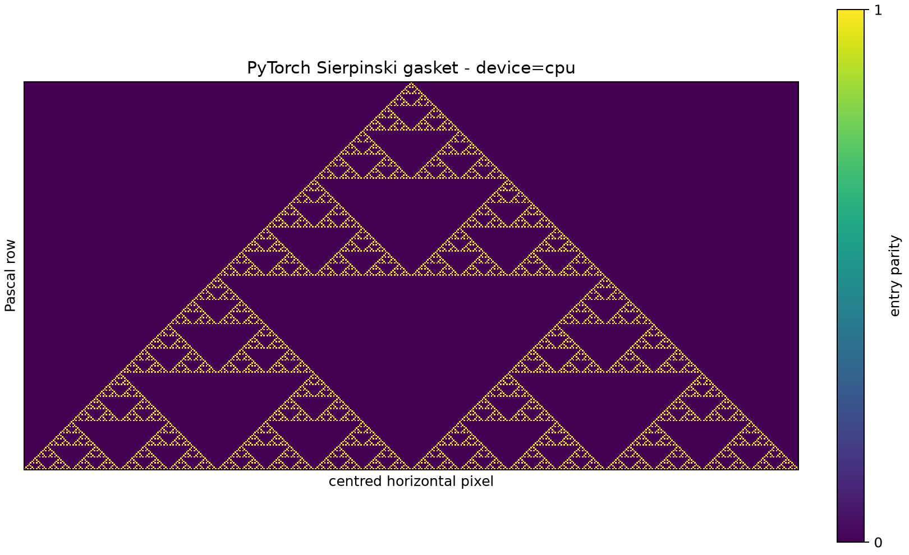
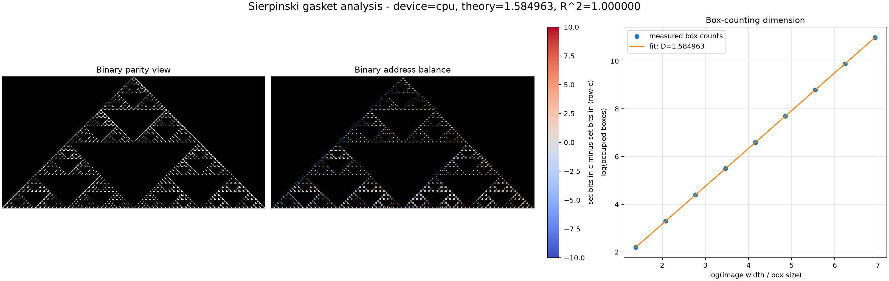

# COMP3710 Lab 1 Part 3 - Sierpinski Gasket

This repository develops the **Sierpinski gasket by binary addresses** from
Section 2.10 of *Fractals for the Classroom*. It is a new Part 3 project and
does not reuse the earlier Sierpinski carpet proposal.

## Current status

- Fractal choice: confirmed from a textbook section explicitly suggested by
  the lab sheet.
- Development stage: PyTorch core and substantial dimension/colour analysis
  complete.
- Remote repository: connected to the student-created GitHub repository.
- The submitted figures and CSV files under `outputs/` were generated locally
  by the same commands documented below.

## Planned evidence

1. A reviewed PyTorch implementation in which pixels are evaluated in
   parallel on CPU, with optional Apple MPS or NVIDIA CUDA support when those
   devices are available.
2. Checks using known Pascal rows and the exact point counts `3^n`.
3. A box-counting estimate compared with the theoretical dimension
   `log(3) / log(2)`.
4. More than one visualisation, with parameters and colours explained.
5. A staged record of the [AI prompts](AI_PROMPTS.md) used during development.

## Local environment

The existing `comp3710` conda environment can be reused:

```bash
conda activate comp3710
cd /Users/baoxuwang/Documents/3710/part3_sierpinski_gasket
```

To recreate it later:

```bash
conda env create -f environment.yml
```

Run the reviewed PyTorch stage with:

```bash
python tests/verify_torch_gasket.py
python src/torch_gasket.py --rows 256 --device cpu
```

`--device` accepts `auto`, `cpu`, `mps`, or `cuda`; the submitted demonstration
uses `cpu` so it runs without a GPU. The program keeps the calculation on the
selected device and transfers only the finished raster to CPU for Matplotlib.

Run the dimension and colour analysis with:

```bash
python tests/verify_analysis.py
python src/analyse_gasket.py --rows 1024 --device cpu
```

This writes a three-panel figure and the measured box counts to `outputs/`.

## AI prompts

The staged prompts used during development are recorded in
[`AI_PROMPTS.md`](AI_PROMPTS.md).

## PyTorch-stage result

For 256 (`2^8`) rows, the CPU tensor contains 6,561 (`3^8`) points in a
`256 x 511` centred raster. Known Pascal rows, exact point counts, tensor
types, device placement, and the display mapping are checked by the retained
verification script. The generated figure was visually inspected.

## Dimension-analysis result

For a 1,024-row gasket, power-of-two box sizes from 1 through 256 produced
counts from 59,049 down to 9. The fitted box-counting dimension was
`1.584962501`, agreeing with `log(3) / log(2)` to floating-point precision,
with `R^2 = 1.0`. The analysis figure includes the binary view, an
address-balance colour view, and the fitted log-log line.

## Demonstration outputs

All figures below are committed so they remain visible during the demo. They
can also be regenerated locally using the commands above.

### PyTorch CPU result



### Dimension and address-colour analysis



The measured box counts are available in
[`outputs/box_counts.csv`](outputs/box_counts.csv).
